```mermaid
flowchart TB

subgraph VERCEL["▲ VERCEL HOBBY · no vercel.json — a COOP header breaks OAuth (R20)"]
    BUNDLE["Static SPA<br/>Vite build output"]
    AGENT["/api/agent<br/>PHASE 2 ONLY — not in MVP<br/>Admin SDK · verifyIdToken"]
end

subgraph BROWSER["🌐 BROWSER TAB — one tab = one sessionId (R2)"]

    MAIN["main.tsx"]
    APP["App.tsx<br/>auth gate"]

    subgraph AUTHD["src/auth"]
        AP["AuthProvider.tsx<br/>loading / signedIn / signedOut"]
        AM["authMachine.ts ✅<br/>+ 5s Safari timeout (R4)"]
        UA["useAuth.ts<br/>exposes getIdToken"]
        LP["LoginPage.tsx<br/>+ demo credentials"]
        SF["SignupForm.tsx<br/>name to state BEFORE call (R11)"]
        GB["GoogleButton.tsx<br/>signInWithPopup, sync-first (R20)"]
        AE["authErrors.ts ✅"]
    end

    subgraph CANVASD["src/canvas — Konva scene graph, shapes only"]
        CP["CanvasPage.tsx"]
        CS["CanvasStage.tsx<br/>Stage + separate Layers (R7)"]
        TB["Toolbar.tsx<br/>Select / Rectangle"]
        SLAY["ShapeLayer.tsx"]
        SREC["ShapeRect.tsx<br/>memoised"]
        UV["useViewport.ts<br/>pan+zoom — LOCAL ONLY, never synced"]
        UPL["usePlacement.ts"]
        PL["placement.ts ✅<br/>5px + empty-background guard (R13)"]
    end

    subgraph OVERD["src/overlay — DOM above the stage, NOT Konva (R3, R21)"]
        CO["CursorOverlay.tsx"]
        RC["RemoteCursor.tsx<br/>transition transform 60ms linear"]
        PB["PresenceBar.tsx<br/>deduped by uid"]
        CB["ConnectionBadge.tsx<br/>Reconnecting indicator"]
    end

    subgraph DEVD["src/dev"]
        SC["SeedControls.tsx<br/>Seed 500 / Clear all"]
        SEED["seed.ts ✅<br/>ONE multi-path update (R22)"]
    end

    subgraph SYNCD["src/sync — one hook per traffic class"]
        US["useShapes.ts<br/>onChildAdded / Changed / Removed"]
        SR["shapesReducer.ts ✅<br/>Map + echo suppression (R6, R7)"]
        SW["shapeWrites.ts<br/>set · update 20Hz · remove"]
        SL["shapeLocks.ts ✅<br/>canDrag predicate (R10)"]
        UP["usePresence.ts<br/>onDisconnect + 10s heartbeat"]
        PU["presenceUtils.ts ✅<br/>dedupeByUid · isStale (R2, R17)"]
        UCUR["useCursors.ts<br/>world coords, movement-gated"]
        UCON["useConnection.ts"]
    end

    subgraph LIBD["src/lib — pure. no React, no Firebase, no side effects"]
        COORD["coords.ts ✅<br/>world to screen · zoomAtPoint (R3)"]
        THR["throttle.ts ✅<br/>timestamp + trailing flush (R16)"]
        COL["colors.ts ✅<br/>uid to stable colour"]
        SESS["session.ts<br/>crypto.randomUUID once per tab"]
        TYP["types.ts"]
        FBC["firebase.ts<br/>SDK singleton · config hardcoded (R1)"]
    end
end

subgraph FB["🔥 FIREBASE PROJECT — us-central1, irreversible (R15) · Spark free tier (R14)"]
    AUTHSVC["Firebase Authentication<br/>email+password · Google OAuth<br/>no verification gate"]
    RULES{{"Security Rules<br/>auth != null<br/>guards EVERY read and write"}}

    subgraph RTDBG["Realtime Database — single instance, the whole backend"]
        SHAPES["/shapes/:id<br/>DURABLE + in-flight drag<br/>x y w h fill draggedBy"]
        CURS["/cursors/:sessionId<br/>EPHEMERAL · 20 Hz<br/>u x y — WORLD coords"]
        PRES["/presence/:sessionId<br/>EPHEMERAL · 10s heartbeat<br/>uid name colour lastSeen"]
        INFO["/.info/connected<br/>/.info/serverTimeOffset"]
    end
end

BUNDLE -->|"HTTPS · initial page load"| MAIN
MAIN --> APP
APP --> AP
APP --> LP
APP --> CP

AP --> AM
AP --> UA
LP --> SF
LP --> GB
LP --> AE

CP --> CS
CP --> TB
CP --> CO
CP --> PB
CP --> CB
CP --> SC
CP --> US
CP --> UP
CP --> UCUR
CP --> UCON
CS --> SLAY
CS --> UV
CS --> UPL
UPL --> PL
SLAY --> SREC
SREC --> SL
SREC --> SW
CO --> RC
SC --> SEED

US --> SR
UP --> PU
UV --> COORD
UCUR --> COORD
UCUR --> THR
CO --> COORD
CO --> COL
UP --> COL
UCUR --> SESS
UP --> SESS
SW --> SESS

UCON -.->|"gates writes · re-arms onDisconnect (R9)"| UCUR
UCON -.->|"gates writes · skew-corrects staleness (R17)"| UP

AP -->|"onAuthStateChanged"| FBC
SF -->|"createUserWithEmailAndPassword"| FBC
GB -->|"signInWithPopup"| FBC
FBC <-->|"ID token · session in IndexedDB"| AUTHSVC
AUTHSVC -->|"JWT validates against"| RULES

SW -->|"set · update 20Hz · remove"| SHAPES
US <-->|"onChild events — NEVER onValue (R7)"| SHAPES
UCUR <-->|"update + onValue subtree"| CURS
UP <-->|"set + heartbeat + onDisconnect"| PRES
UCON <-->|"connected · clock offset"| INFO

RULES -.->|"guards"| RTDBG
AGENT -.->|"PHASE 2 · writes shapes, clients pick up free"| SHAPES

classDef tested stroke:#22c55e,stroke-width:3px
class AM,AE,PL,SEED,SR,SL,PU,COORD,THR,COL tested
```

# CollabCanvas — Architecture

Visual companion to [PRD.md](PRD.md) and [TASKS.md](TASKS.md). Annotations reference risks
(`R1`–`R22`) from the PRD.

**Reading it:** top-to-bottom is the request path — Vercel serves the bundle, the bundle
runs React, React drives Konva and the sync hooks, the hooks talk to Firebase.
`✅` marks a module extracted as a pure function so it can be unit-tested.
`:id` / `:sessionId` denote a key segment.

---

---

## Notes

**One backend product.** Realtime Database carries all four traffic classes. No Firestore,
no Cloud Functions, no Firebase Hosting — see PRD §4.2 for why.

**All Firebase access funnels through `firebase.ts`.** The hook-to-path edges above are
logical operations; every one physically travels the single guarded WebSocket the SDK
singleton owns.

**`src/lib` and the ✅ modules have no edges into React or Firebase.** That's deliberate —
it's what lets ten modules be unit-tested without mocking anything, and it's not a
coincidence that the PRD's critical risks concentrate there. Bugs invisible in the UI tend
to be bugs in pure logic.

*Type-only imports of `types.ts` are omitted; nearly every module imports it and the edges
would bury the runtime dependencies.*

### Behaviour the diagram can't show

Three sequences matter as much as the structure. Mermaid can't express ordering inside a
flowchart, so they're written out here.

**Drag, across two clients** — `ShapeRect` → `shapeWrites` → `/shapes/:id` → `shapesReducer`:
1. `onDragStart` adds the id to a local dragging `Set`, writes `draggedBy = uid`, and
   registers an `onDisconnect` that clears it so a crash can't lock a shape forever `[R10]`.
2. While dragging, position writes go out at 20 Hz **to the durable node** — there is no
   separate ephemeral drag channel.
3. Your own write echoes back. Because the id is in the dragging `Set`, the reducer
   **ignores it**. Without this the node snaps backward then forward at the throttle
   frequency — nearly invisible on localhost, pronounced over a real network `[R6]`.
4. Remote clients apply the position **raw, with no smoothing**. Cursors get a CSS
   transition; dragged shapes must not, or the rectangle lags the cursor dragging it `[R21]`.
5. `onDragEnd` writes the final position and clears `draggedBy` — and removes the id from
   the dragging `Set` **only after that write is acknowledged**. Release earlier and the
   final echo re-applies a stale position.
6. A `removed` event must **also** clear the id, or a shape deleted mid-drag stays
   permanently suppressed `[R6]`.

**Auth states** — `authMachine.ts`, starting at `loading`:
- `onAuthStateChanged` with a user → `signedIn`; with null → `signedOut`.
- **No event within 3–5s → `signedOut` anyway.** `firebase-js-sdk` #7888 reports the
  callback failing to fire in *normal* Safari due to an IndexedDB `AbortError`. Without
  this edge, an affected user sees the splash forever — a white screen on the deployed URL
  that won't reproduce in Chrome `[R4]`.
- While `loading`: render a neutral splash, never the login form, and mount **no** RTDB
  listeners — they'd be denied by rules and fail silently `[R4]`.

**Presence lifecycle** — why `onDisconnect` registration nests inside `.info/connected`:
- On `connected = true`: **await** both `onDisconnect().remove()` calls *before* writing
  the online value, then write presence.
- Register once at startup instead and the handler is gone after the first blip — so the
  *second* disconnect leaves a permanent ghost. Because it only appears on the second
  disconnect, it survives casual testing and surfaces during grading `[R9]`.
- On `connected = false`: suppress all writes. RTDB queues them in memory and flushes on
  reconnect, so an ungated cursor stream replays stale positions and the remote cursor
  rubber-bands through an obsolete path `[R9]`.
- The 10s heartbeat is the backstop, since Firebase publishes no ungraceful-disconnect
  timeout. Its staleness filter must be skew-corrected via `.info/serverTimeOffset` and
  must **fail open** — a ghost is a blemish, an empty presence list is a failed gate
  item `[R17]`.
